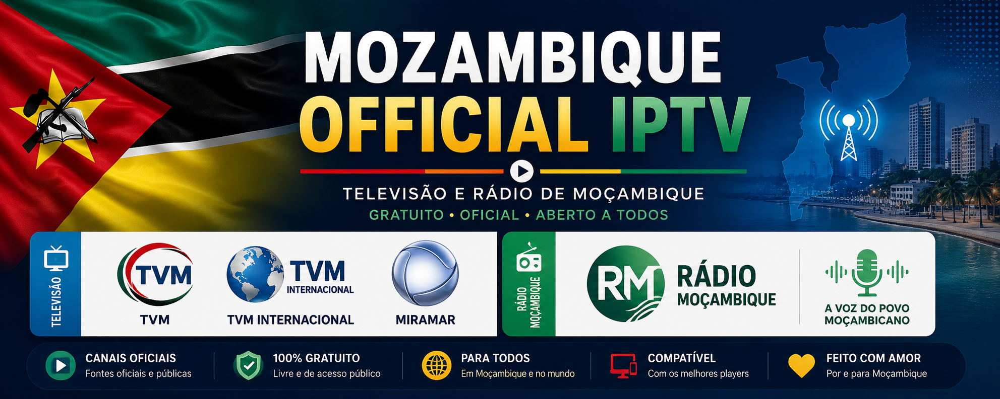

# 🇲🇿 Mozambique IPTV




Professional IPTV Playlist for Mozambique.

Official public IPTV playlist of Mozambique.

--------------------------------------------------

## 📥 Download

Download the latest official playlist.

| Playlist | Link |
|----------|------|
| 🇲🇿 Complete Playlist | https://raw.githubusercontent.com/RodAssane/Mozambique-IPTV/main/playlist/mozambique.m3u |
| 📺 TV Only | https://raw.githubusercontent.com/RodAssane/Mozambique-IPTV/main/playlist/tv.m3u |
| 📻 Radio Only | https://raw.githubusercontent.com/RodAssane/Mozambique-IPTV/main/playlist/radio.m3u |
| ⭐ Favorites | https://raw.githubusercontent.com/RodAssane/Mozambique-IPTV/main/playlist/favorites.m3u |

## 📺 Available Playlists

| Playlist | Description |
|----------|-------------|
| 🇲🇿 Complete | All official television and radio channels |
| 📺 TV | Television channels only |
| 📻 Radio | Rádio Moçambique stations |
| ⭐ Favorites | Main recommended channels |

## 📡 Compatibility

Compatible with:

- ✅ VLC
- ✅ Kodi
- ✅ TiviMate
- ✅ IPTV Smarters
- ✅ OTT Navigator
- ✅ Televizo
- ✅ Hot Player
- ✅ Smart TVs (LG, Samsung, Android TV)


## 📺 TV Channels

<table>
<tr>
<td align="center" width="33%">

<br>

### TVM

🇲🇿 Televisão de Moçambique

▶️ <a href="https://stream.tvm.co.mz/hls/tvm/playlist.m3u8">Watch Live</a>

📄 <a href="https://raw.githubusercontent.com/RodAssane/Mozambique-IPTV/main/playlist/tv.m3u">TV Playlist</a>

</td>

<td align="center" width="33%">

<br>

### TVM Internacional

🌍 International Channel

▶️ <a href="https://stream.tvm.co.mz/hls/tvmi/playlist.m3u8">Watch Live</a>

📄 <a href="https://raw.githubusercontent.com/RodAssane/Mozambique-IPTV/main/playlist/tv.m3u">TV Playlist</a>

</td>

<td align="center" width="33%">

<br>

<br>

### Miramar

📺 Television Channel

▶️ <a href="https://cdn.mycloudstream.io/hls/live/broadcast/8xdonf9w/360p.m3u8">Watch Live</a>

📄 <a href="https://raw.githubusercontent.com/RodAssane/Mozambique-IPTV/main/playlist/tv.m3u">TV Playlist</a>

</td>
</tr>
</table>

## 📻 Rádio Moçambique

<table>
<tr>
<td align="center" width="35%">

<br>

## Rádio Moçambique

# 📻 Rádio Moçambique

<table>
<tr>

<td width="32%" align="center">


## Rádio Moçambique

**A Voz do Povo Moçambicano**

🇲🇿 Serviço Público de Radiodifusão

---

📡 **11 Estações Oficiais**

🌍 Cobertura Nacional

🎧 Streaming Público

---

### ▶️ Acesso rápido

📻 **[Open Radio Playlist](https://raw.githubusercontent.com/RodAssane/Mozambique-IPTV/main/playlist/radio.m3u)**

</td>

<td width="68%">

## 🇲🇿 Estações Nacionais

| Estação | Cobertura |
|---------|-----------|
| 📻 Antena Nacional | Nacional |
| ⚽ RM Desporto | Nacional |

---

## 🏙️ Estações Urbanas

| Estação | Cidade |
|---------|---------|
| 🌆 Rádio Cidade Maputo | Maputo |
| 🌊 Rádio Cidade Beira | Beira |
| 🚆 Rádio Maputo Corredor | Maputo |
| 📡 Maputo FM | Maputo |

---

## 📍 Estações Provinciais

| Estação | Província |
|---------|-----------|
| 🌴 EP Gaza | Gaza |
| 🏖️ Inhambane FM | Inhambane |
| 🌿 Manica FM | Manica |
| 🌊 EP Sofala | Sofala |
| ⛰️ Tete FM | Tete |

</td>

</tr>
</table>

## 📊 Rádio Moçambique em números

| Indicador | Valor |
|-----------|------:|
| 📻 Estações | **11** |
| 🌍 Cobertura | **Nacional** |
| 🎧 Streaming | **24/7** |
| 📄 Formato | **M3U / HLS** |
| 📡 Operador | **Rádio Moçambique** |

## 🖼 Official Logos

<div align="center">

| TVM | TVM Internacional | Miramar | Rádio Moçambique |
|:---:|:-----------------:|:--------:|:----------------:|
|  |  |  |  |

</div>

---

# 🌍 Main Playlist

### Complete Mozambique IPTV Playlist

```text
https://raw.githubusercontent.com/RodAssane/Mozambique-IPTV/main/playlist/mozambique.m3u
```

---

# ⚡ Features

| Feature | Status |
|---------|:------:|
| 📺 Official TV Channels | ✅ |
| 📻 Official Radio Stations | ✅ |
| 🖼 Official Logos | ✅ |
| 📂 Multiple Playlists | ✅ |
| 🌐 GitHub Pages | ✅ |
| 📡 HLS Streams | ✅ |
| 📅 XMLTV / EPG | 🚧 Coming Soon |
| 🔄 Automatic Updates | 🚧 Planned |

---

# 📱 Compatible With

<div align="center">

| Player | Supported |
|---------|:---------:|
| VLC | ✅ |
| Kodi | ✅ |
| TiviMate | ✅ |
| OTT Navigator | ✅ |
| IPTV Smarters | ✅ |
| Hot Player | ✅ |
| Televizo | ✅ |
| Sparkle TV | ✅ |
| Smart IPTV | ✅ |
| SS IPTV | ✅ |
| Android TV | ✅ |
| Google TV | ✅ |
| LG webOS | ✅ |
| Samsung Tizen | ✅ |

</div>

---

# 📜 License

This repository **does not host television or radio content**.

It only indexes **official public streams** made available by the respective broadcasters.

All trademarks, logos and streams remain the property of their respective owners.

---

# 🤝 Contributing

Contributions are welcome.

If you know of an official public television or radio stream from Mozambique that is not yet listed, feel free to open an Issue or submit a Pull Request.

---

<div align="center">

## 🇲🇿 Mozambique Official IPTV

Made with ❤️ for Mozambique

**Version 1.0**

</div>ective broadcasters.
